# Music Playlist Manager

## About
This is my final OOP project. The app lets you create and manage music playlists and songs.
It has both a console interface (CLI) and a graphical interface (JavaFX GUI).

## Student: 
Eldar Karypbekov

---

## What the app can do
- Register and login with password protection
- Create, rename and delete playlists
- Add, rename and delete songs in playlists
- Export playlists to JSON and CSV files
- Import playlists from JSON and CSV files
- Admin panel for managing users and roles

---

## Requirements List

1. CRUD operations for playlists and songs
2. Command line interface with menus
3. Input validation (empty fields, wrong duration, wrong id)
4. Data is saved in SQLite database and stays between sessions
5. Code is split into packages: model, manager, storage, ui, util
6. README documentation
7. Error handling with try-catch in all operations
8. Encapsulation - all fields are private with getters and setters
9. Inheritance - PodcastEpisode extends Song
10. Polymorphism - toString() is overridden differently in Song, PodcastEpisode and Playlist

---

## OOP Concepts Used

Encapsulation - fields in Song, Playlist, User are private, accessed through getters/setters

Inheritance - PodcastEpisode extends Song. It adds podcastName and episodeNumber fields
and calls super() in the constructor to pass the base fields to Song

Polymorphism - toString() is overridden in Song, PodcastEpisode and Playlist.
Each class returns a different formatted string

---

## Project Structure
```
src/
├── Main.java
├── manager/
│    ├── AuthManager.java — login, register, SHA-256 hashing
│    ├── PlaylistManager.java — playlist and song logic
│    └── UserManager.java — admin functions
├── model/
│    ├── Song.java — base class
│    ├── PodcastEpisode.java — extends Song
│    ├── Playlist.java — holds list of songs
│    └── User.java — user with role
├── storage/
│    ├── DatabaseManager.java — all SQL queries
│    └── FileManager.java — JSON and CSV export/import
├── ui/
│    ├── CLI.java — console menu
│    └── gui/
│         ├── MainApp.java — JavaFX entry point
│         ├── LoginView.java — login screen
│         ├── MainWindow.java — main window
│         └── PlaylistView.java — songs window
└── util/
└── InputValidator.java — input checks
```
---

## How to run

Run GUI:
mvn javafx:run

Run CLI:
mvn compile
java -cp target/classes Main

---

## Technologies
- Java 17
- SQLite + JDBC
- JavaFX 21
- Gson (for JSON)
- Maven

---

## How data is stored
All data is stored in a local SQLite file called music.db.
There are 3 tables: playlists, songs, users.
Songs have a foreign key linking them to a playlist.
Passwords are hashed with SHA-256 before storing.

---

## Challenges
The hardest part was setting up JavaFX with Maven.
Also had some issues with Scanner input where nextLine() was consuming
empty lines after nextInt(), fixed it by using nextLine() everywhere.

---

## Screenshots
1. Main Menu
   Description: The primary menu displayed when the application starts.
   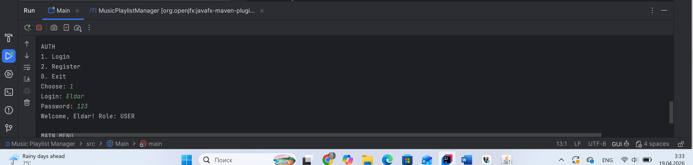

2. Create Song
   Description: Process of adding a new song to the system.
   Expected Output: "Song added successfully!" message.
   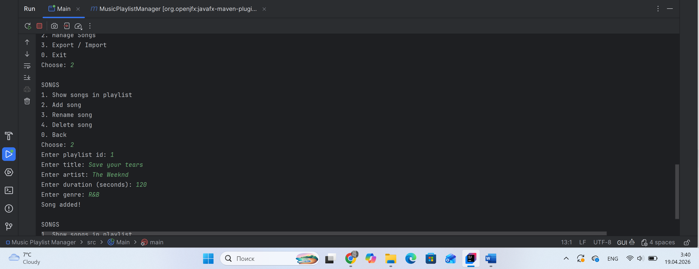

3. View Playlist
   Description: Displaying all recorded songs from the database.
   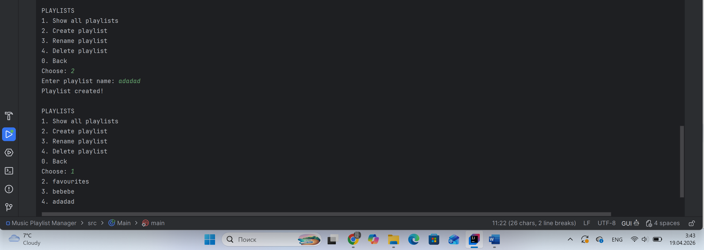

4. Update Record
   Description: Modifying information for an existing song.
   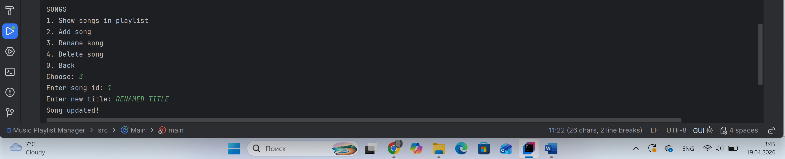

5. Delete Record
   Description: Removing a specific record using its unique ID.
   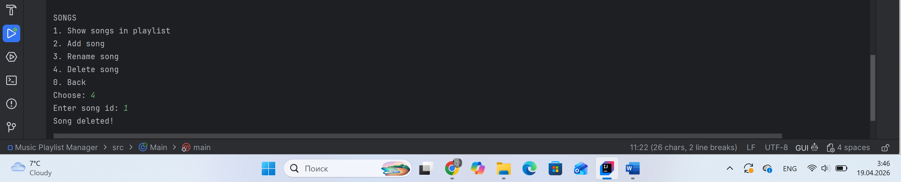

6. Input Validation
   Description: Attempting to enter text (e.g., "abc") instead of a numeric ID.
   Expected Output: Error message and prompt to re-enter the data.
   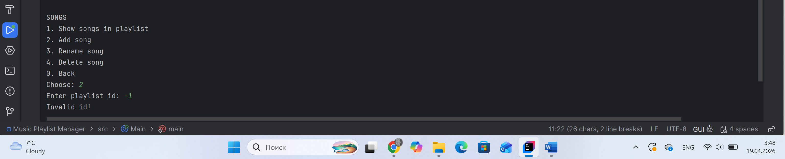

7. Data Persistence
   Description: Verification of stored data inside the SQLite database using a DB browser.
   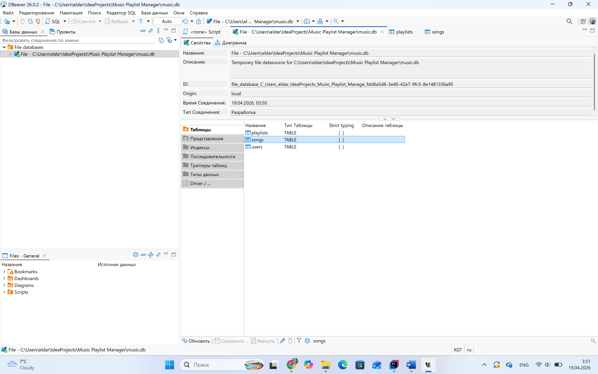
   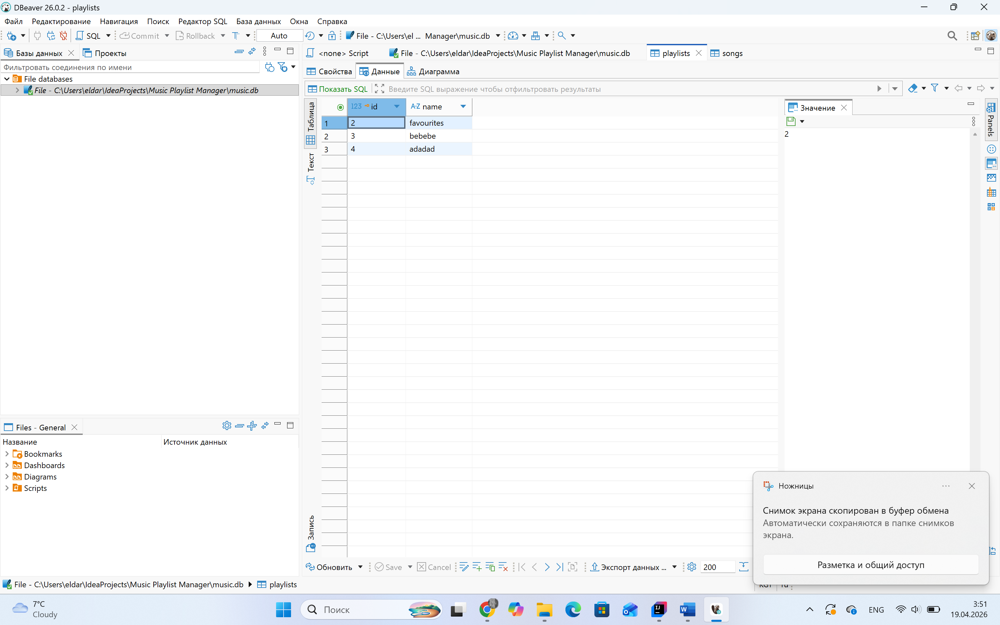
   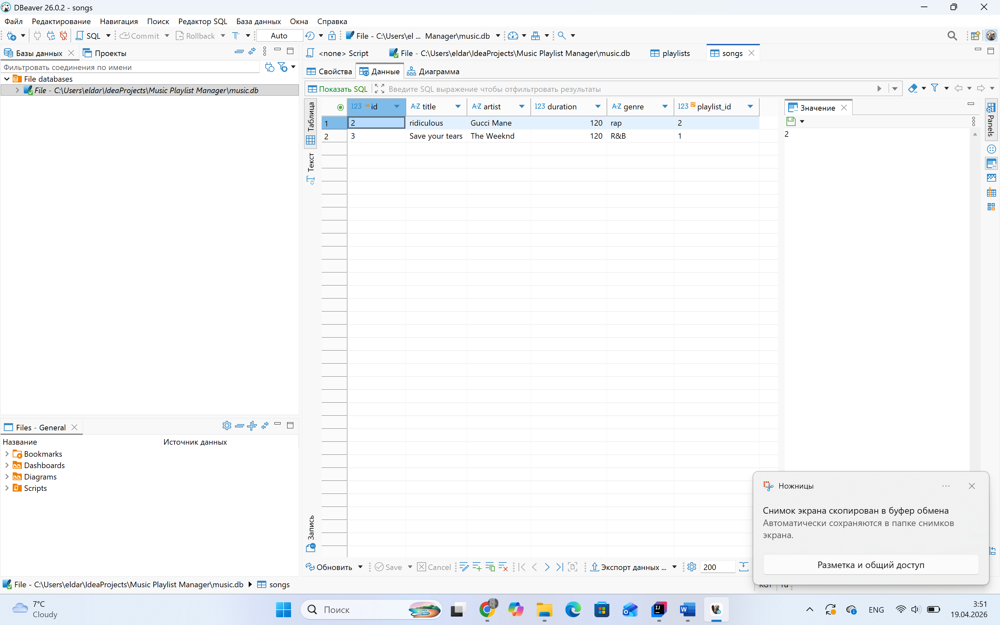

8. Export JSON
   Description: Generating a JSON file containing the current playlist data.
   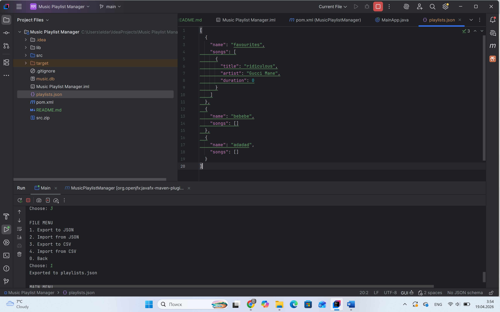

9. Import JSON
   Description: Loading music records from an external JSON file back into the application.
   

10. OOP Principles
    Description: Code snippet showing private fields, getters/setters, and class inheritance.
    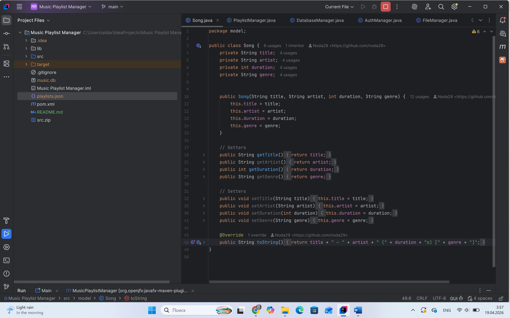

## Presentation
*(link to slides goes here)*
